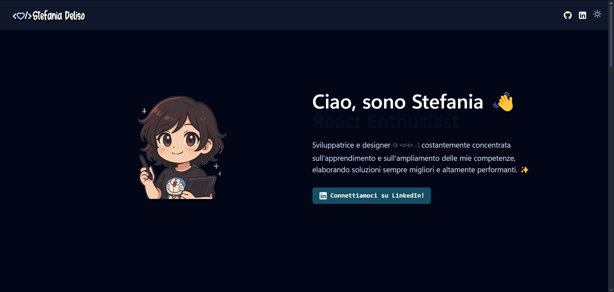

# 🕹️ Stefania Deliso – Front-End Developer Portfolio

Benvenutə nel mio sito portfolio!  
Un mix tra design moderno e vibes nerd, sviluppato con le migliori tecnologie per offrire un'esperienza fluida e accessibile.



---

## 🚀 Tecnologie Utilizzate

- **React** + **Vite** ⚡
- **TypeScript**
- **Tailwind CSS**
- **Framer Motion** per animazioni fluide
- **React Icons** e **Pixel Art** personalizzati
- Modalità **Light/Dark**
- Deploy con **GitHub Pages**

---

## 🎨 Features principali

- Hero section con intro animata e logo personalizzato
- Sezione **About Me** con immagine e badge dinamici
- **Skill-set** con badge in stile *level up*
- Showcase progetti con **modale interattiva**
- Navbar responsive con effetto *compact on scroll*
- Footer completo e curato
- Button "Scroll to top" stile game

---

## 🧠 Cosa rappresenta

> Ogni dettaglio, dai font alla micro-interazione, riflette la mia identità come front-end developer con un background in graphic design e UI/UX.

---

## 🛠️ Setup locale

```bash
# Clona la repo
git clone https://github.com/Darkmindy/portfolio.git

# Entra nella cartella
cd portfolio

# Installa le dipendenze
pnpm install

# Avvia il progetto
pnpm dev

⚠️ Assicurati di avere pnpm installato. In alternativa, puoi usare npm o yarn.

---

## 📦 Deployment
Deploy automatico su GitHub Pages tramite GitHub Actions.
Il workflow è configurato nel file .github/workflows/ci.yml.

---

## 📬 Contatti
Portfolio: stefaniadeliso.dev

GitHub: @Darkmindy

LinkedIn: stefaniad91

Email: stefania.deliso1@gmail.com

---

## 📄 Licenza
MIT © Stefania Deliso